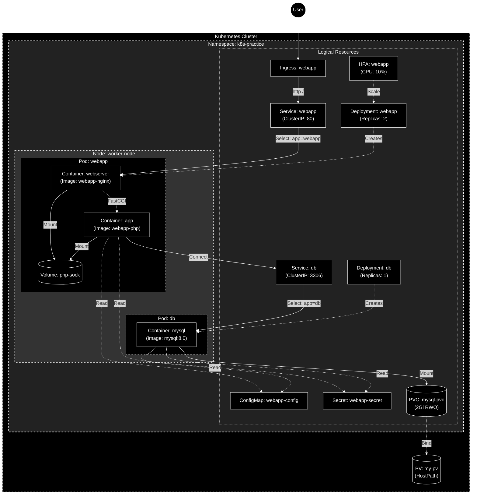

# Kubernetes Architecture

```mermaid
flowchart TD
    %% Dark Mode Styles
    classDef default fill:#000,stroke:#fff,stroke-width:1px,color:#fff;
    classDef cluster fill:#111,stroke:#fff,stroke-width:1px,stroke-dasharray: 5 5,color:#fff;
    
    %% Link Style
    linkStyle default stroke:#fff,stroke-width:1px;

    User((User))

    subgraph Cluster [Kubernetes Cluster]
        style Cluster fill:#000,stroke:#fff,stroke-width:1px,stroke-dasharray: 5 5,color:#fff;

        %% Logical Resources (Namespace Level)
        subgraph NS [Namespace: k8s-practice]
            direction TB
            style NS fill:#222,stroke:#fff,stroke-width:2px,color:#fff

            %% Configs & Control Plane Objects
            subgraph Configs [Logical Resources]
                direction TB
                style Configs fill:#222,stroke:#aaa,stroke-dasharray: 2 2,color:#fff

                Ing["Ingress: webapp"]
                SvcWeb["Service: webapp<br/>(ClusterIP: 80)"]
                
                DeployWeb["Deployment: webapp<br/>(Replicas: 2)"]
                HPA["HPA: webapp<br/>(CPU: 10%)"]
                
                cm["ConfigMap: webapp-config"]
                secret["Secret: webapp-secret"]

                SvcDB["Service: db<br/>(ClusterIP: 3306)"]
                DeployDB["Deployment: db<br/>(Replicas: 1)"]
                
                PVC[("PVC: mysql-pvc<br/>(2Gi RWO)")]
            end

            %% Physical/Runtime Resources (Node Level)
            subgraph Node [Node: worker-node]
                direction TB
                style Node fill:#333,stroke:#fff,stroke-width:2px,color:#fff

                %% Pod Webapp
                subgraph PodWeb [Pod: webapp]
                    style PodWeb fill:#000,stroke:#aaa,stroke-dasharray: 5 5,color:#fff
                    Nginx["Container: webserver<br/>(Image: webapp-nginx)"]
                    PHP["Container: app<br/>(Image: webapp-php)"]
                    SharedVol[("Volume: php-sock")]
                end
                
                %% Pod DB
                subgraph PodDB [Pod: db]
                    style PodDB fill:#000,stroke:#aaa,stroke-dasharray: 5 5,color:#fff
                    MySQL["Container: mysql<br/>(Image: mysql:8.0)"]
                end
            end
            
            %% Wiring within Pods
            Nginx -->|Mount| SharedVol
            PHP -->|Mount| SharedVol
            Nginx -.->|FastCGI| PHP

            %% Connections
            Ing -->|http /| SvcWeb
            SvcWeb -->|Select: app=webapp| Nginx

            HPA -.->|Scale| DeployWeb
            DeployWeb -.->|Creates| Nginx

            PHP -.->|Read| cm
            PHP -.->|Read| secret
            PHP -->|Connect| SvcDB
            
            SvcDB -->|Select: app=db| MySQL
            DeployDB -.->|Creates| MySQL

            MySQL -.->|Read| cm
            MySQL -.->|Read| secret
            
            MySQL -->|Mount| PVC
        end
        
        PVC -.->|Bind| PV[("PV: my-pv<br/>(HostPath)")]
    end
    
    User --> Ing
```
